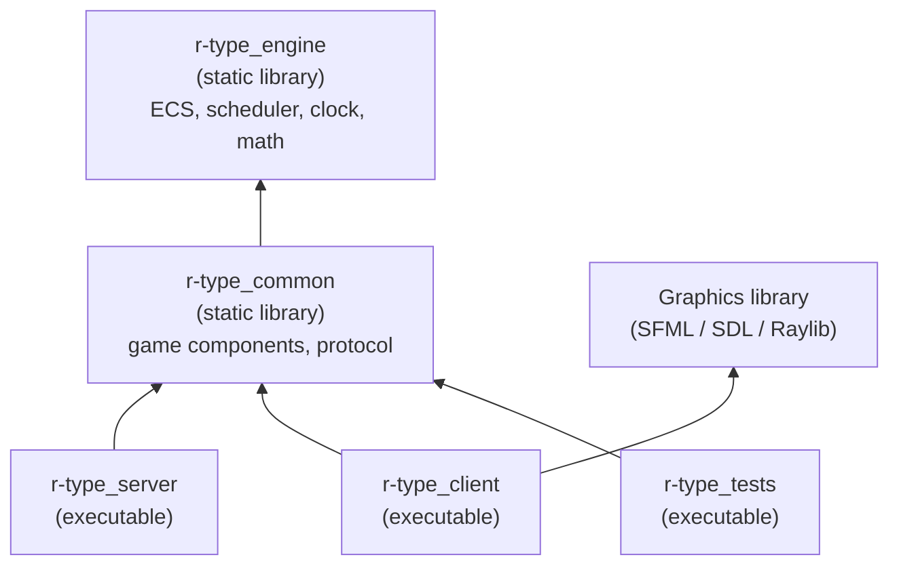
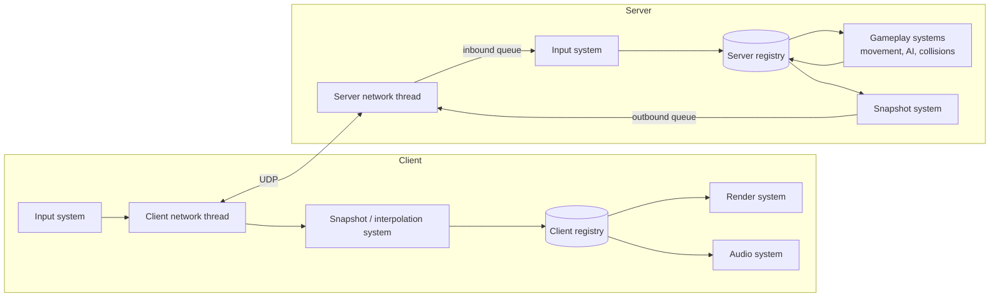
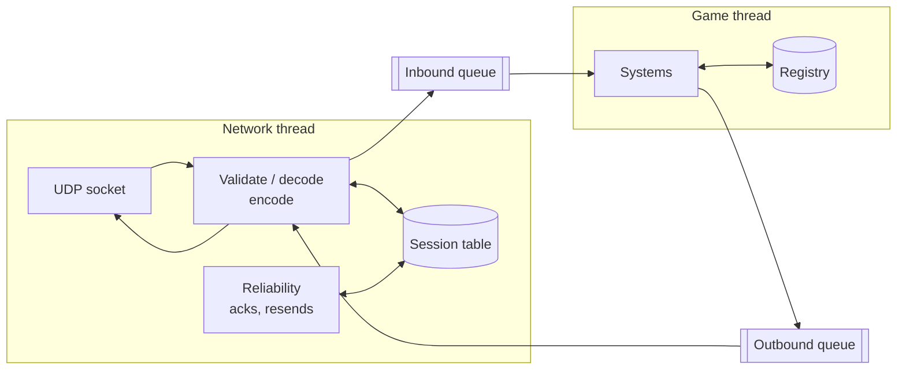
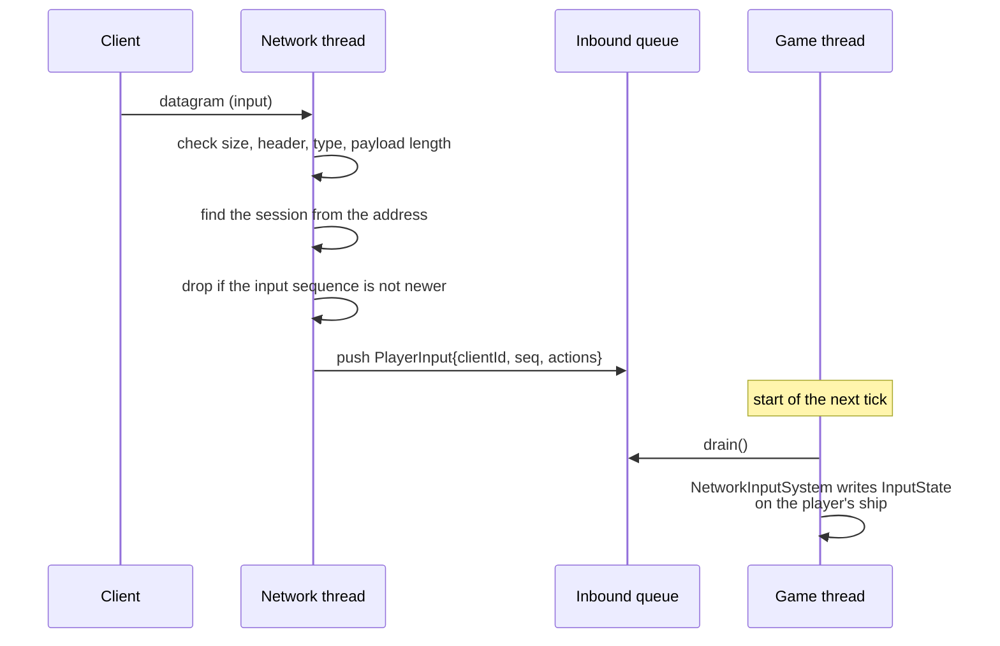
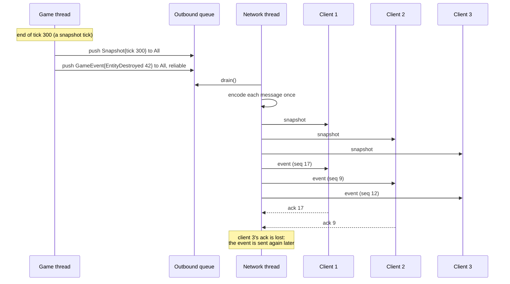
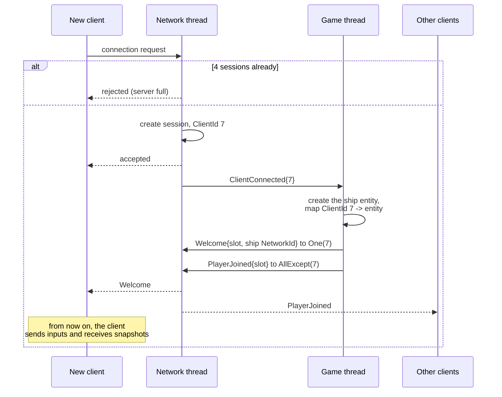

# Architecture (v1)

This document describes how the R-Type code is organized: the shared engine, the
Entity Component System (ECS), the subsystems and how they communicate, the game
loop and the threading model. The network protocol itself is described in
[PROTOCOL.md](PROTOCOL.md).

> Status: **v1 draft**. Nothing here is implemented yet. Open points are listed
> at the end of the document.

## 1. Goals

The design follows the subject's constraints:

- **Decoupled subsystems.** Rendering, networking and game logic are separate.
  The rendering system only needs an entity's appearance and position, not its
  damage or speed.
- **Authoritative server.** The server owns the game state. Clients send their
  inputs and display what the server tells them.
- **The game loop never blocks on the network.** Networking runs on its own
  thread and exchanges messages with the game loop through queues.
- **Time comes from timers, not CPU speed.** The simulation advances by a fixed
  time step measured with a steady clock.
- **Robustness.** Malformed packets or a crashing client must never bring down
  the server.

## 2. Code layout

The code is split into four CMake targets. Arrows mean "links against".



| Directory | Target | Contents | Allowed dependencies |
|-----------|--------|----------|----------------------|
| `engine/` | `r-type_engine` | Generic ECS (entities, components, registry, systems), scheduler, clock, math types. Knows nothing about R-Type. | Standard library only |
| `common/` | `r-type_common` | R-Type components shared by both programs (`Transform`, `Velocity`, `Health`...), protocol messages and their serialization. | `r-type_engine` |
| `server/` | `r-type_server` | Server game loop, gameplay systems (movement, collisions, spawning, AI), client sessions, network thread. | `r-type_common`, server-side packages from the `Dockerfile` |
| `client/` | `r-type_client` | Rendering, input, audio, interpolation, client network thread. | `r-type_common`, graphics library (Conan) |

Rules:

- `engine/` and `common/` must never include anything from `server/`, `client/`
  or a graphics library. The server is built alone in Docker
  (`-DBUILD_CLIENT=OFF`), so it can only use these two libraries.
- Keeping `engine/` game-agnostic makes it reusable for another game, which is
  one of the Part 2 tracks.
- Tests link the libraries directly, so game logic can be tested without
  starting a server or opening a window.

## 3. Entity Component System

### 3.1 Concepts

- **Entity**: an identifier and nothing else. It has no data and no behavior.
- **Component**: plain data attached to an entity (`Transform`, `Velocity`,
  `Sprite`...). Components have no logic.
- **System**: a function that runs every tick on all entities that have a given
  set of components. Systems hold all the logic.
- **Registry**: owns the entities and the component storages, and answers
  queries such as "every entity with a `Transform` and a `Velocity`".

### 3.2 Entities

An entity is a 32-bit index plus a 32-bit generation:

```cpp
struct Entity {
    std::uint32_t index;
    std::uint32_t generation;
};
```

- When an entity is destroyed, its index goes into a free list and its
  generation is incremented.
- When a new entity reuses that index, it gets the new generation. A stale
  handle to the old entity therefore no longer matches, and `registry.alive(e)`
  returns `false` instead of silently pointing at another entity.

### 3.3 Component storage: sparse sets

Each component type has its own storage, a **sparse set**:

```
sparse : entity index -> position in dense   (paged array, holes allowed)
dense  : [ e7, e2, e9, ... ]                  (packed entity indexes)
data   : [ C7, C2, C9, ... ]                  (packed components, same order)
```

- Add, remove and lookup are O(1). Removal swaps the last element into the hole,
  so the arrays stay packed.
- Iterating over a component type walks a contiguous array, which is
  cache-friendly.
- A query over several components (`view<Transform, Velocity>`) iterates the
  smallest storage and checks whether each entity is in the others.

Why sparse sets rather than archetypes: they are much simpler to implement and
debug, adding or removing a component is cheap (no moving the entity between
tables), and R-Type has at most a few thousand entities, where the difference in
iteration speed does not matter.

### 3.4 Registry API (sketch)

```cpp
namespace engine {

class Registry {
public:
    Entity create();
    void destroy(Entity entity);          // deferred, see 3.5
    [[nodiscard]] bool alive(Entity entity) const;

    template <typename C, typename... Args>
    C &emplace(Entity entity, Args &&...args);
    template <typename C> void remove(Entity entity);
    template <typename C> [[nodiscard]] bool has(Entity entity) const;
    template <typename C> C &get(Entity entity);
    template <typename C> C *tryGet(Entity entity);

    template <typename... Cs> View<Cs...> view();

    void flush();                         // applies deferred destructions
};

} // namespace engine
```

Usage in a system:

```cpp
void movementSystem(engine::Registry &registry, engine::Duration dt)
{
    for (auto [entity, transform, velocity] : registry.view<Transform, Velocity>()) {
        transform.position += velocity.value * dt.count();
    }
}
```

### 3.5 Destroying entities during a tick

Destroying an entity while a system iterates over a storage would invalidate the
iteration. `destroy()` therefore only marks the entity. The scheduler calls
`registry.flush()` at the end of each tick, which removes all marked entities
and their components.

### 3.6 Components

- Components are small, plain structs (aggregates). They have no virtual
  functions and no pointers to other components.
- Components that are sent over the network must be trivially copyable, so
  they can be serialized field by field into the binary protocol.
- A reference to another entity is stored as an `Entity` handle and checked with
  `alive()` before use.

First components (in `common/`):

| Component | Data | Used by |
|-----------|------|---------|
| `Transform` | position (`Vec2f`), rotation | movement, collision, rendering, network |
| `Velocity` | `Vec2f` in units per second | movement |
| `Collider` | box size, collision layer and mask | collision |
| `Health` | current and maximum points | damage, death |
| `Damage` | points dealt on contact | collision |
| `Player` | player slot (1-4), score | input, scoring |
| `InputState` | bitmask of pressed actions for this tick | player control |
| `Enemy` | enemy type, behavior parameters | AI |
| `Projectile` | owner entity, lifetime | collision, cleanup |
| `NetworkId` | 32-bit id shared by server and clients | network sync |
| `Sprite` (client) | texture id, frame, layer | rendering |
| `Animation` (client) | frame list, frame duration, elapsed time | animation |

## 4. Systems and subsystems

### 4.1 Communication between subsystems

Subsystems never call each other. They communicate only through:

1. **Components.** The collision system writes `Health`, the rendering system
   reads `Transform` and `Sprite`. Neither knows the other exists.
2. **Events.** One-off facts (`EntityDestroyed`, `PlayerHit`, `PlayerJoined`)
   are pushed to a per-tick event queue. Interested systems read them during
   the same tick, and the queue is cleared at the end of the tick.
3. **Thread-safe message queues**, only between the network thread and the
   game loop (see section 6).

### 4.2 Execution order

Systems are registered in stages. Each tick runs the stages in this order:

| Stage | Server | Client |
|-------|--------|--------|
| 1. Input | Drain the inbound network queue, apply players' `InputState` | Read keyboard and gamepad, send inputs to the server |
| 2. Simulation | Player control, AI, spawning, movement, collisions, damage, death | Apply the latest server snapshot, interpolation, animation |
| 3. Output | Build snapshots and events, push them to the outbound queue | Audio, then rendering |
| 4. Cleanup | `registry.flush()`, clear events | `registry.flush()`, clear events |

### 4.3 Overview



## 5. Time and the game loop

All time values use `std::chrono::steady_clock`, which never goes backwards.
`engine::Duration` is a `std::chrono::duration<float>` in seconds.

### 5.1 Server: fixed time step

The server simulates at a fixed tick rate (v1: **60 ticks per second**) with an
accumulator:

```cpp
constexpr engine::Duration tickDuration{1.0F / 60.0F};
auto previous = Clock::now();
Duration accumulator{};

while (running) {
    const auto now = Clock::now();
    accumulator += now - previous;
    previous = now;

    while (accumulator >= tickDuration) {
        scheduler.runTick(registry, tickDuration);
        accumulator -= tickDuration;
    }
    sleepUntil(previous + tickDuration);
}
```

- Every tick advances the game by exactly `tickDuration`, so the simulation
  gives the same result on a fast or a slow machine.
- Snapshots are sent at a lower rate (v1: **20 per second**, every 3rd tick) to
  save bandwidth.
- If the server falls far behind, the accumulator is capped so it does not try
  to catch up forever.

### 5.2 Client: variable frame rate

The client renders as fast as the display allows (or with V-Sync) and uses the
real elapsed time (delta time) for animations and the star-field scrolling.
Remote entities are drawn slightly in the past and **interpolated** between the
two latest snapshots, so their movement looks smooth even with 20 snapshots per
second.

## 6. Threading and networking

This section explains how the game loop and the network work together: which
thread owns what, how messages cross between threads, and how the server sends
information to every connected client. The byte layout of each packet belongs
in [PROTOCOL.md](PROTOCOL.md); here, messages are described only by their
content.

### 6.1 Threads and ownership

The server runs two threads. Each piece of data has exactly one owner:

| Thread | Owns | Never touches |
|--------|------|---------------|
| Network thread | The UDP socket, the session table (one entry per connected client), encoding and decoding, reliability, timeouts | The registry |

The two threads share only:

- two **message queues**: inbound (network to game) and outbound (game to
  network);
- an atomic `running` flag, used to stop the server (section 6.10).

Because nothing else is shared, there are no locks in the game code and the
systems are written as single-threaded code.



### 6.2 Message queues

Both queues use the same generic type, `engine::MessageQueue<T>` (standard
library only):

- A `std::vector<T>` protected by a `std::mutex`.
- `push(T)` locks, appends and unlocks.
- `drain()` locks, **swaps** the vector with an empty one and unlocks, then
  returns all the messages at once. The lock is held for a swap only, so the
  game thread never waits for the network thread in any meaningful way.
- The queue has a **capacity**. When it is full, new messages are dropped and
  counted. A flood of packets can therefore never make the server allocate
  unbounded memory.

The queues carry **decoded messages** (C++ structs), not raw bytes:

- The game thread never parses packets.
- The game thread never sees an IP address or a port. A client is identified by
  a `ClientId` (a 32-bit number given by the network thread when the client
  connects).

#### Inbound messages (network thread to game thread)

| Message | Content | Pushed when |
|---------|---------|-------------|
| `ClientConnected` | `ClientId` | A new client finished the handshake |
| `ClientDisconnected` | `ClientId`, reason (left, timeout, kicked) | A client said goodbye, stopped answering or broke the protocol |
| `PlayerInput` | `ClientId`, input sequence number, actions bitmask | A valid, newer input arrived |

Pings, acknowledgments and handshake packets are handled entirely by the
network thread and never reach the game thread.

#### Outbound messages (game thread to network thread)

Each outbound message has a **recipient**, a **delivery mode** and a payload:

```cpp
struct Recipient {
    enum class Kind : std::uint8_t { One, All, AllExcept };
    Kind kind;
    ClientId client; // used by One and AllExcept
};

enum class Delivery : std::uint8_t { Unreliable, Reliable };

struct OutboundMessage {
    Recipient to;
    Delivery delivery;
    std::variant<Welcome, Snapshot, GameEvent> payload;
};
```

| Payload | Recipient | Delivery | Content |
|---------|-----------|----------|---------|
| `Welcome` | One (the new player) | Reliable | Player slot, the `NetworkId` of the player's ship, current server tick |
| `Snapshot` | All | Unreliable | Server tick, state of every visible entity (section 6.7) |
| `GameEvent` | All, or AllExcept | Reliable | One-off facts: `EntityDestroyed`, `PlayerJoined`, `PlayerLeft`, `PlayerHit`, `GameOver` |

### 6.3 Sessions

The network thread keeps one **session** per connected client:

| Field | Use |
|-------|-----|
| `ClientId` | Identity shared with the game thread |
| Address and port | Where to send datagrams |
| Last time a packet was received | Timeout detection |
| Last input sequence number | Drop old or duplicated inputs |
| Reliable send state | Next sequence number, messages waiting for an ack |
| Reliable receive state | Last sequence number received, for acks and duplicates |

- Only a known address can send game packets. A datagram from an unknown
  address is accepted only if it is a connection request.
- The server accepts at most **4 sessions**. A fifth client receives a
  rejection and no session is created.

### 6.4 Receiving: from datagram to component



1. The network thread reads one datagram into a fixed-size buffer (the maximum
   packet size). A larger datagram is truncated by the system and rejected.
2. It validates the packet: size, header (protocol id, version), message type,
   payload length. Any failure drops the packet and increments a counter. A
   client that sends too many invalid packets is disconnected.
3. It decodes the payload field by field (explicit little-endian, never a
   `memcpy` of a struct) and pushes the message to the inbound queue.
4. At the start of each tick, the game thread drains the queue. If the queue is
   empty, the tick continues without waiting.
5. If several inputs from the same player arrived during one tick, only the
   newest is kept.

### 6.5 Sending: from the registry to every client

At the end of a tick, the output systems build messages and push them to the
outbound queue. They do not know how many clients are connected or where they
are; they only say "to everyone", "to this player" or "to everyone except this
player".

The network thread then:

1. drains the outbound queue;
2. **encodes each message once** into a byte buffer;
3. resolves the recipient against its session table: `All` means every session
   that exists at that moment;
4. sends the same buffer to each recipient with `sendto`;
5. for a reliable message, keeps a copy per recipient until that client
   acknowledges it (section 6.6).



Encoding once and sending the same bytes to every client keeps the cost low: a
snapshot is built once per snapshot tick, whatever the number of players. Only
the reliable header (sequence number) differs per client.

**When does the network thread run?** It loops on a receive with a short
timeout (about 1 ms). After each wake-up, whether a datagram arrived or the
timeout expired, it also sends the outbound messages, resends unacknowledged
reliable messages that are due, and checks timeouts. With Asio, the same work
is done with asynchronous operations and a timer instead of a loop; the queues
and messages stay the same.

### 6.6 Delivery: unreliable and reliable

UDP can lose, duplicate and reorder datagrams. Each kind of message deals with
it in the simplest way that is enough:

| Kind | Messages | Rule |
|------|----------|------|
| Unreliable, latest wins | Inputs (client to server), snapshots (server to client) | Each carries a sequence number or tick. The receiver keeps only the newest and ignores older ones. A lost packet does not matter: the next one, a few milliseconds later, replaces it. |
| Reliable, ordered | Handshake answers, `Welcome`, game events | Each message has a per-session sequence number. The receiver acknowledges it and delivers messages in order, once. The sender resends every unacknowledged message about every 100 ms. |

Limits that keep reliability safe:

- The number of unacknowledged messages per session is capped. A client that
  never acknowledges (or acknowledges too slowly) is disconnected instead of
  making the server store messages forever.
- Acknowledgments are added to the packets already being sent (inputs and
  snapshots), so they cost almost no extra packets.

### 6.7 Snapshots

A snapshot is the state of every entity the client needs to draw, at a given
server tick.

- It is built by the `SnapshotSystem` every 3rd tick (20 per second).
- For each entity with a `NetworkId`, it contains the id, the entity type
  (which sprite to use), the position and the few values the HUD needs
  (health, score).
- A datagram should stay under about **1200 bytes** to avoid IP fragmentation.
  With about 20 bytes per entity, that is about 60 entities per datagram. A
  larger snapshot is split into several **parts**; each part is
  self-contained (tick + list of entities), so losing one part only delays the
  update of those entities.

How the client uses snapshots:

- An unknown `NetworkId` in a snapshot creates a local entity with the right
  `Sprite`.
- A known `NetworkId` updates its target position for interpolation.
- An entity is **removed** only by the reliable `EntityDestroyed` event, never
  because it is missing from a snapshot (that part may just have been lost).
- `NetworkId`s are never reused by the server, and the client remembers
  recently destroyed ids for a few seconds, so a late snapshot cannot bring a
  destroyed entity back.

Snapshots also act as a heartbeat: a client that receives nothing from the
server for a few seconds considers the connection lost.

### 6.8 Connection lifecycle

#### A player joins



#### A player leaves, crashes or misbehaves

All three cases end the same way:

| Case | Detected by |
|------|-------------|
| The player quits | The client sends a disconnect message (best effort, not reliable) |
| The client crashes or the network drops | No packet from that client for **5 seconds** (inputs are sent continuously, so silence means a problem) |
| The client breaks the protocol | Too many invalid packets, or too many unacknowledged reliable messages |

Then:

1. The network thread removes the session and pushes
   `ClientDisconnected{id, reason}`.
2. The game thread destroys the player's ship and pushes `PlayerLeft{slot}` to
   `All`, reliable.
3. The remaining clients remove the ship and can show a message.

The game keeps running for the other players during all of this.

### 6.9 Client side

The client uses the same pattern with roles reversed:

| Thread | Job |
|--------|-----|
| Main thread | Input, client registry and systems, rendering (graphics libraries require rendering on the main thread) |
| Network thread | Socket, handshake, validation and decoding, reliable events and acks, server timeout |

- **Outbound:** the input system pushes the **complete** input state (a bitmask
  of pressed actions) at a fixed rate, about 60 times per second, whatever the
  frame rate. Sending the full state every time means a lost packet is
  corrected by the next one, and a key release can never get lost.
- **Inbound:** the main thread drains snapshots and events each frame. The
  snapshot system keeps the last few snapshots in a small buffer, and the
  interpolation system draws remote entities about **100 ms in the past**
  (two snapshot intervals), between the two snapshots around that time.

### 6.10 Shutdown

- `SIGINT` and `SIGTERM` (sent by `docker stop`) set the atomic `running` flag
  to `false`. The signal handler does nothing else.
- The game loop finishes its current tick, pushes a best-effort `ServerClosing`
  message to `All`, and stops.
- The network thread sends what is left in the outbound queue, then stops; the
  game thread joins it.
- A client closing its window does the same on its side: it sends a disconnect
  message, stops its network thread and exits.

### 6.11 Summary of network-related systems

| Side | Stage | System | Job |
|------|-------|--------|-----|
| Server | Input | `SessionSystem` | `ClientConnected` / `ClientDisconnected`: create or destroy ships, push `Welcome`, `PlayerJoined`, `PlayerLeft` |
| Server | Input | `NetworkInputSystem` | `PlayerInput`: write `InputState` on the right ship |
| Server | Output | `SnapshotSystem` | Every 3rd tick, push a `Snapshot` to `All` |
| Server | Output | `EventBroadcastSystem` | Turn the tick's game events into reliable `GameEvent` messages |
| Client | Input | `InputSystem` | Read the keyboard and gamepad, push the input state |
| Client | Simulation | `SnapshotApplySystem` | Create and update entities from snapshots, remove them on `EntityDestroyed` |
| Client | Simulation | `InterpolationSystem` | Place remote entities between two snapshots |

## 7. Coordinate system and units

- **Playfield**: a fixed virtual area of **1920 x 1080 units**, whatever the
  window size. The client scales it to the window and keeps the aspect ratio
  (letterboxing).
- **Origin**: top-left corner. **x** grows to the right, **y** grows downwards
  (the convention of SFML, SDL and Raylib).
- **Units**: positions in units, velocities in units per second, time in
  seconds, angles in radians. Values are `float`.
- **Scrolling**: the camera does not move. The background star field scrolls to
  the left, and enemies spawn just past the right edge (`x > 1920`) and move
  left. Entities that leave the playfield by more than a margin are destroyed.
- `Transform.position` is the **center** of the entity. Colliders are
  axis-aligned boxes centered on it.

## 8. Testing

- The ECS (entity reuse, generations, storages, views, deferred destruction) is
  covered by unit tests in `tests/`.
- Gameplay systems are tested by creating a registry, adding a few entities,
  running the system for N ticks and checking the components. No window or
  socket is needed.
- Packet decoding is unit tested with valid, truncated and oversized packets,
  and later fuzzed with libFuzzer.
- The message queue (capacity, drain order) and the reliability logic (acks,
  resends, duplicates, reordering) are tested without a socket, by feeding
  them packets directly.

## 9. Open questions

- **Graphics library**: SFML, SDL or Raylib (the client architecture does not
  depend on the choice).
- **Network library**: raw sockets or Asio for the network threads (see
  [PROTOCOL.md](PROTOCOL.md) and issue #32).
- **Client-side prediction** of the local player's ship, to hide latency. Not
  planned for v1.
- **Tick and snapshot rates**: 60 and 20 per second are starting values, to be
  tuned once the prototype runs. The same goes for the network values of
  section 6: 5 s timeout, 100 ms resend interval, 100 ms interpolation delay,
  1200-byte datagrams, queue capacities.
- **Lobby and game start**: v1 starts the game as soon as a player joins.
  Rooms, a lobby or a "ready" step are not designed yet.
- **Windows support** (issue #6): the design above has no Linux-only parts
  except the sockets, which would be hidden behind the network library.
