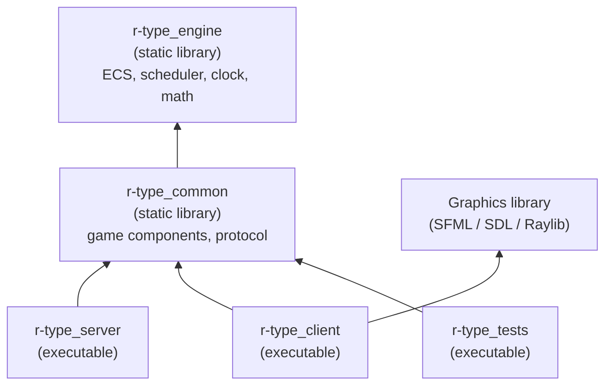
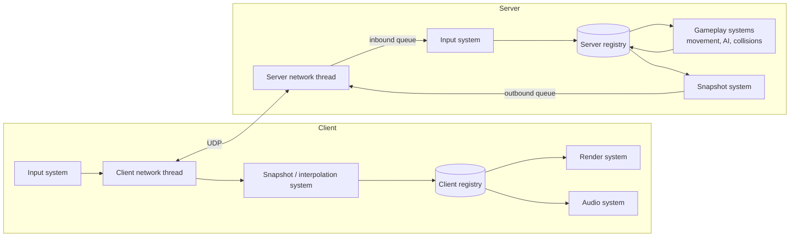

# Architecture (v1)

This document describes how the R-Type code is organized: the shared engine, the
Entity Component System (ECS), the subsystems and how they communicate, the game
loop and the threading model. The network protocol itself is described in
[PROTOCOL.md](PROTOCOL.md).

> Status: **v1 draft**. Nothing here is implemented yet. Open points are listed
> at the end of the document.

## 1. Goals

The design follows the subject's constraints:

- **Decoupled subsystems.** Rendering, networking and game logic are separate.
  The rendering system only needs an entity's appearance and position, not its
  damage or speed.
- **Authoritative server.** The server owns the game state. Clients send their
  inputs and display what the server tells them.
- **The game loop never blocks on the network.** Networking runs on its own
  thread and exchanges messages with the game loop through queues.
- **Time comes from timers, not CPU speed.** The simulation advances by a fixed
  time step measured with a steady clock.
- **Robustness.** Malformed packets or a crashing client must never bring down
  the server.

## 2. Code layout

The code is split into four CMake targets. Arrows mean "links against".



| Directory | Target | Contents | Allowed dependencies |
|-----------|--------|----------|----------------------|
| `engine/` | `r-type_engine` | Generic ECS (entities, components, registry, systems), scheduler, clock, math types. Knows nothing about R-Type. | Standard library only |
| `common/` | `r-type_common` | R-Type components shared by both programs (`Transform`, `Velocity`, `Health`...), protocol messages and their serialization. | `r-type_engine` |
| `server/` | `r-type_server` | Server game loop, gameplay systems (movement, collisions, spawning, AI), client sessions, network thread. | `r-type_common`, server-side packages from the `Dockerfile` |
| `client/` | `r-type_client` | Rendering, input, audio, interpolation, client network thread. | `r-type_common`, graphics library (Conan) |

Rules:

- `engine/` and `common/` must never include anything from `server/`, `client/`
  or a graphics library. The server is built alone in Docker
  (`-DBUILD_CLIENT=OFF`), so it can only use these two libraries.
- Keeping `engine/` game-agnostic makes it reusable for another game, which is
  one of the Part 2 tracks.
- Tests link the libraries directly, so game logic can be tested without
  starting a server or opening a window.

## 3. Entity Component System

### 3.1 Concepts

- **Entity**: an identifier and nothing else. It has no data and no behavior.
- **Component**: plain data attached to an entity (`Transform`, `Velocity`,
  `Sprite`...). Components have no logic.
- **System**: a function that runs every tick on all entities that have a given
  set of components. Systems hold all the logic.
- **Registry**: owns the entities and the component storages, and answers
  queries such as "every entity with a `Transform` and a `Velocity`".

### 3.2 Entities

An entity is a 32-bit index plus a 32-bit generation:

```cpp
struct Entity {
    std::uint32_t index;
    std::uint32_t generation;
};
```

- When an entity is destroyed, its index goes into a free list and its
  generation is incremented.
- When a new entity reuses that index, it gets the new generation. A stale
  handle to the old entity therefore no longer matches, and `registry.alive(e)`
  returns `false` instead of silently pointing at another entity.

### 3.3 Component storage: sparse sets

Each component type has its own storage, a **sparse set**:

```
sparse : entity index -> position in dense   (paged array, holes allowed)
dense  : [ e7, e2, e9, ... ]                  (packed entity indexes)
data   : [ C7, C2, C9, ... ]                  (packed components, same order)
```

- Add, remove and lookup are O(1). Removal swaps the last element into the hole,
  so the arrays stay packed.
- Iterating over a component type walks a contiguous array, which is
  cache-friendly.
- A query over several components (`view<Transform, Velocity>`) iterates the
  smallest storage and checks whether each entity is in the others.

Why sparse sets rather than archetypes: they are much simpler to implement and
debug, adding or removing a component is cheap (no moving the entity between
tables), and R-Type has at most a few thousand entities, where the difference in
iteration speed does not matter.

### 3.4 Registry API (sketch)

```cpp
namespace engine {

class Registry {
public:
    Entity create();
    void destroy(Entity entity);          // deferred, see 3.5
    [[nodiscard]] bool alive(Entity entity) const;

    template <typename C, typename... Args>
    C &emplace(Entity entity, Args &&...args);
    template <typename C> void remove(Entity entity);
    template <typename C> [[nodiscard]] bool has(Entity entity) const;
    template <typename C> C &get(Entity entity);
    template <typename C> C *tryGet(Entity entity);

    template <typename... Cs> View<Cs...> view();

    void flush();                         // applies deferred destructions
};

} // namespace engine
```

Usage in a system:

```cpp
void movementSystem(engine::Registry &registry, engine::Duration dt)
{
    for (auto [entity, transform, velocity] : registry.view<Transform, Velocity>()) {
        transform.position += velocity.value * dt.count();
    }
}
```

### 3.5 Destroying entities during a tick

Destroying an entity while a system iterates over a storage would invalidate the
iteration. `destroy()` therefore only marks the entity. The scheduler calls
`registry.flush()` at the end of each tick, which removes all marked entities
and their components.

### 3.6 Components

- Components are small, plain structs (aggregates). They have no virtual
  functions and no pointers to other components.
- Components that are sent over the network must be trivially copyable, so
  they can be serialized field by field into the binary protocol.
- A reference to another entity is stored as an `Entity` handle and checked with
  `alive()` before use.

First components (in `common/`):

| Component | Data | Used by |
|-----------|------|---------|
| `Transform` | position (`Vec2f`), rotation | movement, collision, rendering, network |
| `Velocity` | `Vec2f` in units per second | movement |
| `Collider` | box size, collision layer and mask | collision |
| `Health` | current and maximum points | damage, death |
| `Damage` | points dealt on contact | collision |
| `Player` | player slot (1-4), score | input, scoring |
| `InputState` | bitmask of pressed actions for this tick | player control |
| `Enemy` | enemy type, behavior parameters | AI |
| `Projectile` | owner entity, lifetime | collision, cleanup |
| `NetworkId` | 32-bit id shared by server and clients | network sync |
| `Sprite` (client) | texture id, frame, layer | rendering |
| `Animation` (client) | frame list, frame duration, elapsed time | animation |

## 4. Systems and subsystems

### 4.1 Communication between subsystems

Subsystems never call each other. They communicate only through:

1. **Components.** The collision system writes `Health`, the rendering system
   reads `Transform` and `Sprite`. Neither knows the other exists.
2. **Events.** One-off facts (`EntityDestroyed`, `PlayerHit`, `PlayerJoined`)
   are pushed to a per-tick event queue. Interested systems read them during
   the same tick, and the queue is cleared at the end of the tick.
3. **Thread-safe message queues**, only between the network thread and the
   game loop (see section 6).

### 4.2 Execution order

Systems are registered in stages. Each tick runs the stages in this order:

| Stage | Server | Client |
|-------|--------|--------|
| 1. Input | Drain the inbound network queue, apply players' `InputState` | Read keyboard and gamepad, send inputs to the server |
| 2. Simulation | Player control, AI, spawning, movement, collisions, damage, death | Apply the latest server snapshot, interpolation, animation |
| 3. Output | Build snapshots and events, push them to the outbound queue | Audio, then rendering |
| 4. Cleanup | `registry.flush()`, clear events | `registry.flush()`, clear events |

### 4.3 Overview



## 5. Time and the game loop

All time values use `std::chrono::steady_clock`, which never goes backwards.
`engine::Duration` is a `std::chrono::duration<float>` in seconds.

### 5.1 Server: fixed time step

The server simulates at a fixed tick rate (v1: **60 ticks per second**) with an
accumulator:

```cpp
constexpr engine::Duration tickDuration{1.0F / 60.0F};
auto previous = Clock::now();
Duration accumulator{};

while (running) {
    const auto now = Clock::now();
    accumulator += now - previous;
    previous = now;

    while (accumulator >= tickDuration) {
        scheduler.runTick(registry, tickDuration);
        accumulator -= tickDuration;
    }
    sleepUntil(previous + tickDuration);
}
```

- Every tick advances the game by exactly `tickDuration`, so the simulation
  gives the same result on a fast or a slow machine.
- Snapshots are sent at a lower rate (v1: **20 per second**, every 3rd tick) to
  save bandwidth.
- If the server falls far behind, the accumulator is capped so it does not try
  to catch up forever.

### 5.2 Client: variable frame rate

The client renders as fast as the display allows (or with V-Sync) and uses the
real elapsed time (delta time) for animations and the star-field scrolling.
Remote entities are drawn slightly in the past and **interpolated** between the
two latest snapshots, so their movement looks smooth even with 20 snapshots per
second.

## 6. Threading

### 6.1 Server

```
Network thread                                   Game thread
--------------                                   -----------
receive datagram
validate size and header  -- drop if invalid
decode message            -- drop if invalid
push to inbound queue  ------------------------> drain inbound queue (tick start)
                                                 run systems
send datagrams         <------------------------ push to outbound queue (tick end)
detect client timeouts -> push "client left" --> remove the player's entity, notify others
```

- The game thread never touches the socket, and the network thread never touches
  the registry. The two queues are the only shared data.
- Draining the inbound queue never waits: if it is empty, the tick continues.
- Every packet is validated (size limit, header, message type, payload length)
  before being decoded. Invalid packets are dropped and counted, never trusted.
- A client that stops sending packets for a few seconds is considered
  disconnected. Its entity is removed and the other clients are notified.

### 6.2 Client

The client uses the same pattern: a network thread with two queues, and the main
thread for input, simulation and rendering (graphics libraries require rendering
on the main thread).

## 7. Coordinate system and units

- **Playfield**: a fixed virtual area of **1920 x 1080 units**, whatever the
  window size. The client scales it to the window and keeps the aspect ratio
  (letterboxing).
- **Origin**: top-left corner. **x** grows to the right, **y** grows downwards
  (the convention of SFML, SDL and Raylib).
- **Units**: positions in units, velocities in units per second, time in
  seconds, angles in radians. Values are `float`.
- **Scrolling**: the camera does not move. The background star field scrolls to
  the left, and enemies spawn just past the right edge (`x > 1920`) and move
  left. Entities that leave the playfield by more than a margin are destroyed.
- `Transform.position` is the **center** of the entity. Colliders are
  axis-aligned boxes centered on it.

## 8. Testing

- The ECS (entity reuse, generations, storages, views, deferred destruction) is
  covered by unit tests in `tests/`.
- Gameplay systems are tested by creating a registry, adding a few entities,
  running the system for N ticks and checking the components. No window or
  socket is needed.
- Packet decoding is unit tested with valid, truncated and oversized packets,
  and later fuzzed with libFuzzer.

## 9. Open questions

- **Graphics library**: SFML, SDL or Raylib (the client architecture does not
  depend on the choice).
- **Network library**: raw sockets or Asio for the network threads (see
  [PROTOCOL.md](PROTOCOL.md) and issue #32).
- **Client-side prediction** of the local player's ship, to hide latency. Not
  planned for v1.
- **Tick and snapshot rates**: 60 and 20 per second are starting values, to be
  tuned once the prototype runs.
- **Windows support** (issue #6): the design above has no Linux-only parts
  except the sockets, which would be hidden behind the network library.
